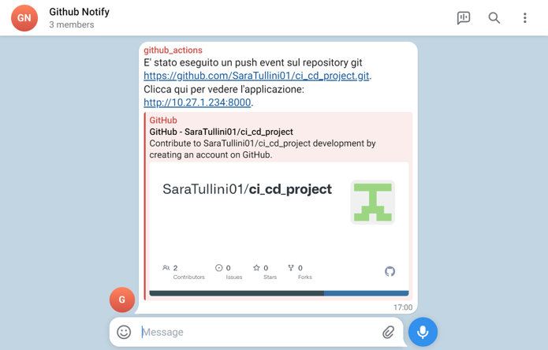
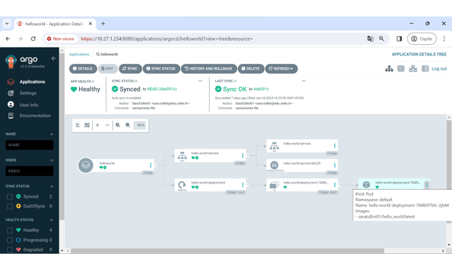
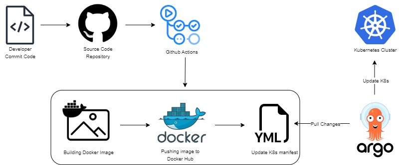

# DevOps: Sviluppo di una pipeline CI/CD con GitHub Actions e Argo CD

Il presente repository documenta il progetto di tesi di laurea in **Ingegneria Elettronica e Informatica** (A.A. 2022/2023), dedicato alla progettazione e all’implementazione di una **pipeline di Continuous Integration e Continuous Deployment (CI/CD)** secondo i principi del **DevOps** e del **GitOps**.

Il progetto ha l’obiettivo di dimostrare, attraverso un caso di studio concreto, come sia possibile automatizzare l’intero ciclo di vita di un’applicazione containerizzata utilizzando strumenti moderni e largamente adottati in ambito DevOps.

---

## Obiettivo del progetto

L’obiettivo principale del lavoro è la realizzazione di una pipeline CI/CD completa che consenta di:

- automatizzare la fase di integrazione continua del codice
- costruire e pubblicare immagini Docker in modo automatico
- gestire il deployment applicativo su cluster Kubernetes
- applicare il paradigma GitOps per il mantenimento dello stato desiderato dell’infrastruttura

Il progetto si inserisce nel contesto delle pratiche DevOps, con particolare attenzione alla separazione tra fase di **Continuous Integration**, gestita tramite GitHub Actions, e fase di **Continuous Deployment**, affidata ad Argo CD.

---

## Tecnologie e strumenti utilizzati

Il progetto si basa sull’integrazione dei seguenti strumenti:

- **Docker**: containerizzazione dell’applicazione
- **GitHub Actions**: automazione dei workflow di Continuous Integration
- **Kubernetes**: orchestrazione dei container
- **Minikube**: ambiente Kubernetes locale
- **Argo CD**: gestione del Continuous Deployment secondo l’approccio GitOps
- **Docker Hub**: registry per la pubblicazione delle immagini Docker
- **Telegram Bot API**: sistema di notifica automatica

---

## Continuous Integration

La fase di Continuous Integration è implementata mediante **GitHub Actions** e si articola in più workflow automatizzati.

### Workflow di build dell’immagine Docker

Il workflow principale (`docker-build.yml`) esegue le seguenti operazioni:

- costruzione dell’immagine Docker a partire dal `Dockerfile`
- tagging dell’immagine con lo SHA del commit
- pubblicazione dell’immagine su Docker Hub
- creazione del tag `latest`
- generazione e aggiornamento di un file di log versionato

---

### Workflow di notifica Telegram

Un secondo workflow (`telegram-notify.yml`) è dedicato all’invio di notifiche automatiche tramite Telegram, utilizzando un bot configurato mediante secrets GitHub.

Questo meccanismo consente di monitorare l’esecuzione della pipeline e ricevere feedback immediati sugli eventi principali.

---

## Continuous Deployment e GitOps

La fase di Continuous Deployment è gestita tramite **Argo CD**, che opera secondo un modello GitOps basato su pull.

I manifest Kubernetes (Deployment e Service) sono mantenuti in un repository dedicato, costantemente monitorato da Argo CD. Ogni modifica ai file di configurazione viene automaticamente rilevata e applicata al cluster Kubernetes, garantendo l’allineamento tra stato desiderato e stato effettivo dell’applicazione.

L’interfaccia grafica di Argo CD consente inoltre di visualizzare in tempo reale lo stato dell’applicazione e delle risorse associate.

---

## Flusso complessivo della pipeline CI/CD

Il funzionamento complessivo della pipeline CI/CD sviluppata nel progetto è rappresentato nella figura seguente, che riassume l’interazione tra le diverse componenti coinvolte nelle fasi di integrazione continua e distribuzione continua.

---

## Risultati ottenuti

Il progetto dimostra come l’adozione di una pipeline CI/CD automatizzata consenta di:

- ridurre l’intervento manuale nel processo di deployment
- migliorare la tracciabilità delle modifiche
- garantire coerenza tra codice, configurazione e infrastruttura
- applicare in modo efficace i principi DevOps e GitOps

---

## Possibili estensioni future

Il lavoro può essere ulteriormente esteso introducendo:

- test automatici (unitari e di integrazione)
- controlli di sicurezza (DevSecOps)
- sistemi di monitoraggio e logging
- gestione multi-ambiente (sviluppo, test, produzione)
- meccanismi avanzati di rollback automatico

---

## Riferimenti

Il progetto è stato sviluppato nell’ambito della tesi di laurea:

**DevOps: Sviluppo di una pipeline CI/CD con GitHub Actions e ArgoCD**  
Autrice: *Sara Tullini*  
Relatore: Prof. Ing. Mauro Tortonesi  
Correlatore: Ing. Alessandro Gilli
